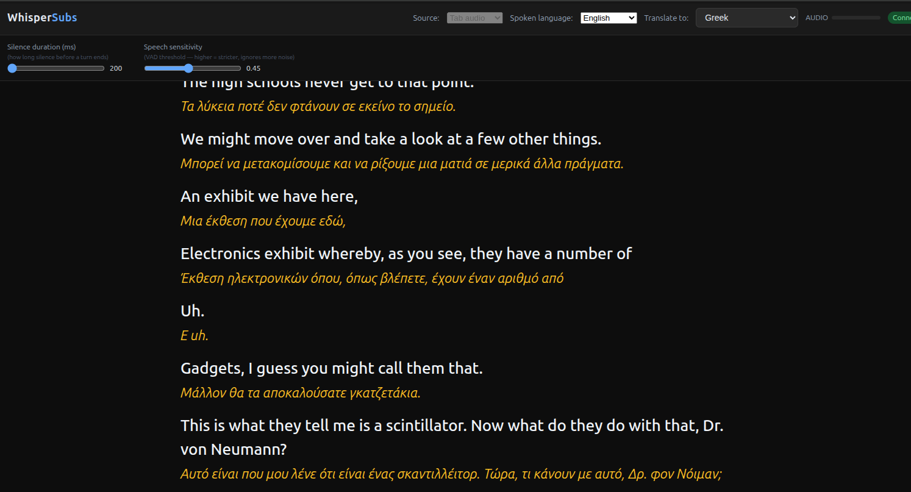

# WhisperSubs

Real-time speech transcription and translation in your browser, powered by OpenAI's Realtime API.

Stream audio from any browser tab or microphone and get live subtitles with sub-second latency — with optional translation into 30+ languages, SRT export, and a floating subtitle overlay you can drag over any video player.



---

## Features

- **Real-time transcription** — word-by-word streaming via OpenAI Realtime API + `gpt-4o-transcribe`
- **Live translation** — instant translation into 30+ languages powered by GPT-4o-mini
- **Floating subtitle overlay** — detachable popup window you can position over any video on your desktop
- **SRT export** — download every session as a timestamped `.srt` subtitle file
- **Live chat** — ask questions about what's being said; context is automatically summarized as the session grows
- **Source language selection** — lock to a specific language or let the model auto-detect
- **VAD controls** — tune speech sensitivity and silence duration via the advanced panel
- **Tab or mic capture** — capture any browser tab's audio or your microphone

---

## Requirements

- Python 3.11+
- An [OpenAI API key](https://platform.openai.com/api-keys) with access to the Realtime API
- A modern Chromium-based browser (for tab audio capture via `getDisplayMedia`)

---

## Setup

```bash
git clone https://github.com/youruser/whispersubs.git
cd whispersubs

python3 -m venv .venv
source .venv/bin/activate
pip install -r requirements.txt

cp .env.example .env
# edit .env and add your OPENAI_API_KEY
```

---

## Running

```bash
python3 -m uvicorn backend.main:app --host 0.0.0.0 --port 8000 --reload
```

Open `http://localhost:8000` in your browser.

---

## Usage

1. Select **Source** (Tab audio or Microphone) and optionally pick a **Spoken language**
2. Pick a **Translate to** language if you want live translation
3. Click **Start** — for tab audio, select a tab in Chrome's dialog and check *Share tab audio*
4. Captions stream in real time. Click **⧉** for the floating subtitle overlay
5. Click **💬** to open the live chat panel and ask questions about the content
6. Click **↓ SRT** to download the session transcript as a subtitle file

---

## Configuration

All settings have sensible defaults. Override via `.env`:

| Variable | Default | Description |
|---|---|---|
| `OPENAI_API_KEY` | — | Required |
| `REALTIME_MODEL` | `gpt-4o-realtime-preview` | Realtime API connection model |
| `WHISPER_MODEL` | `gpt-4o-transcribe` | Transcription engine |
| `TRANSLATION_MODEL` | `gpt-4o-mini` | Translation model |
| `CHAT_MODEL` | `gpt-4o-mini` | Live chat model |
| `WHISPER_LANGUAGE` | *(auto)* | Lock source language (e.g. `en`, `es`) |
| `TARGET_LANGUAGE` | *(none)* | Default translation target |
| `NO_SPEECH_THRESHOLD` | `0.5` | VAD speech sensitivity (0–1) |
| `SILENCE_RMS_THRESHOLD` | `500` | Silence duration before turn ends (ms) |

---

## Architecture

```
Browser
  └─ MediaStream (tab / mic) at 24 kHz
       └─ ScriptProcessor → raw PCM16 binary frames
            └─ WebSocket /ws (FastAPI)
                 ├─ WebSocket → OpenAI Realtime API
                 │    └─ transcript deltas / completed events
                 ├─ GPT-4o-mini translation (per turn)
                 ├─ In-memory SRT store (per session)
                 └─ Chat endpoint (rolling summary + GPT)
```

---

## License

MIT
